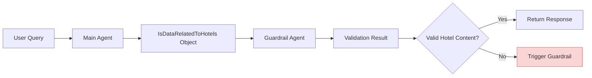
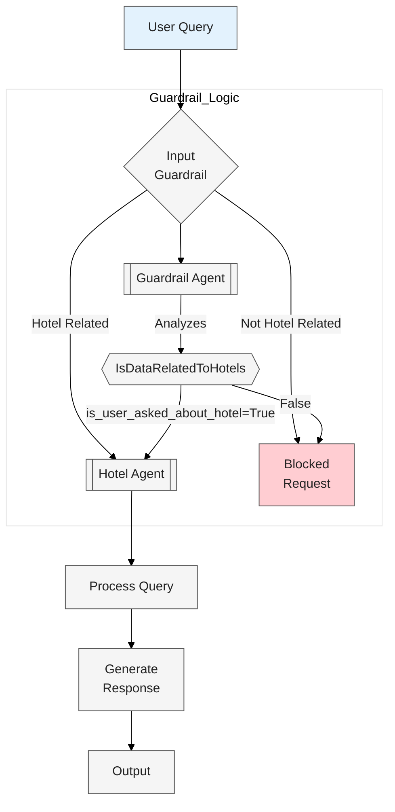
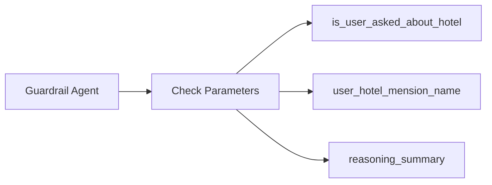
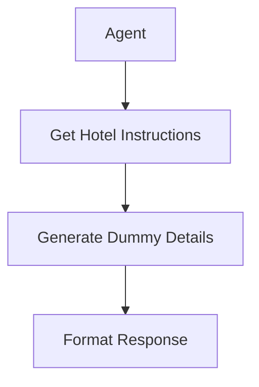

# Customer Support.md

# Guardrail
## Input Guardrails: The input not allowed.
## Output Guardrails: The output not allowed.

```
from project import model
from agents import Agent, function_tool,Runner,ModelSettings,RunContextWrapper,GuardrailFunctionOutput,input_guardrail
import asyncio
from pydantic import BaseModel

class HotelCheckOutput(BaseModel):
    is_queries_related_to_hotelSannata:bool
    reasoning: str

guardrail_agent = Agent(name="Guardrail Agent", model=model, output_type=HotelCheckOutput,
                        instructions="Check if the user query is related to Sannata Hotel. Respond with true/false and give reasoning.") 

@input_guardrail
async def hotel_guardrail(ctx:RunContextWrapper, agent:Agent, input) ->GuardrailFunctionOutput:
    result = await Runner.run(guardrail_agent, input, context=ctx.context)
    return GuardrailFunctionOutput(output_info=result.final_output , tripwire_triggered= not result.final_output.is_queries_related_to_hotelSannata)

general_agent = Agent(name="General Agent",instructions="You are helpful assistant to answer queries about Sannata hotel with dummy information",
                      input_guardrails=[hotel_guardrail], model=model)

async def main():
    try:
        prompt = input("Enter your queries: \n\t" )
        result=await Runner.run(general_agent, prompt)
        print(result.final_output)

    except Exception as er:
        print("❌ Hotel guardrail tripped: ", er)

if __name__ == "__main__":
    asyncio.run(main())
```

# Output Guardrails
```
from project import model
from agents import Agent, Runner, RunContextWrapper, GuardrailFunctionOutput, output_guardrail
import asyncio
from pydantic import BaseModel

class HotelCheckOutput(BaseModel):
    is_queries_related_to_hotelSannata: bool
    reasoning: str

guardrail_agent2 = Agent(
    name="Guardrail Agent",
    model=model,
    output_type=HotelCheckOutput,
    instructions="Check if the output includes any Sannata hotel information."
)

@output_guardrail
async def hotel_guardrail(ctx: RunContextWrapper, agent: Agent, output: str) -> GuardrailFunctionOutput:
    result = await Runner.run(guardrail_agent2, output)
    return GuardrailFunctionOutput(
        output_info=result.final_output,
        tripwire_triggered=not result.final_output.is_queries_related_to_hotelSannata
    )

general_agent = Agent(
    name="General Agent",
    model=model,
    instructions="You are helpful assistant to answer queries about Sannata hotel with dummy information",
    output_guardrails=[hotel_guardrail]
)

async def main():
    try:
        prompt = input("Enter your queries: \n\t")
        result = await Runner.run(general_agent, prompt)
        print(result.final_output)
    except Exception as er:
        print("❌ Error occurred: ", er)

if __name__ == "__main__":
    asyncio.run(main())

```

## Guardrail System Architecture

```
from project import model
import asyncio
from agents import Agent,Runner,RunContextWrapper,GuardrailFunctionOutput,input_guardrail,enable_verbose_stdout_logging
from pydantic import BaseModel

enable_verbose_stdout_logging()

class IsDataRelatedToHotels(BaseModel):
    """Checks if the query is related to relevant hotels"""
    is_query_related_to_sannata_hotel: bool
    is_query_related_to_veerana_hotel: bool
    reasoning_summary_of_hotels: str
    user_asked_about_hotel_name:str

guardrail_agent =Agent(name="Guardrail Agent", model=model, output_type=IsDataRelatedToHotels
    ,instructions="Check the query is related to Sannata or Veerana hotels or both.If yes, extract the user discussed hotel name the user name is asking about.")

@input_guardrail
async def hotel_guardrail(ctx: RunContextWrapper, agent: Agent, input_text: str) -> GuardrailFunctionOutput:
    result = await Runner.run(guardrail_agent, input_text, context=ctx.context)
    output = result.final_output
    hotel_name=output.user_asked_about_hotel_name
    return GuardrailFunctionOutput(output_info=output, tripwire_triggered= not(output.is_query_related_to_sannata_hotel or output.is_query_related_to_veerana_hotel))

def dynamic_instructions(ctx: RunContextWrapper[IsDataRelatedToHotels],agent:Agent):
    return f"Help users to book and get detail about {hotel_name} with dummy details."

agent =Agent(name="GeneralAgent", model=model, input_guardrails=[hotel_guardrail],
    instructions=dynamic_instructions)

async def main():
    try:
        guard_result = await Runner.run(agent, "WHowre the owner of Veerana and Sannat hotels")
        print(guard_result.final_output)

    except Exception as er:
        print("Tripwire triggered :", str(er))

if __name__ =="__main__":
    asyncio.run(main())
```







