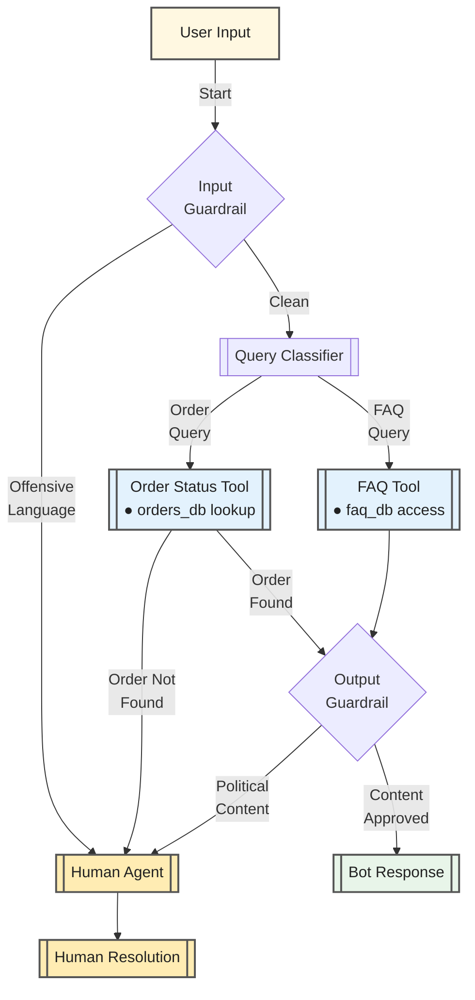

```
# Ensure resf is a boolean (True or False)
return_value = bool(getattr(resf, "is_query_about_order", False))

```

```
from project import model
import asyncio
from classes import IsQueryAboutOrder, IsOutputPolitical, IsLanguageOfUserIsOffensive
from agents import Agent, Runner, RunContextWrapper, GuardrailFunctionOutput, function_tool, input_guardrail, output_guardrail,ModelSettings
from mock_db import faq_db, orders_db

guardrail_agent = Agent(name="Language Guardrail agent",instructions="check for offensive or negative language" ,model=model, output_type=IsLanguageOfUserIsOffensive)
 #Plotical Output guardrail
political_agent_guardrail=Agent(name="Political Guardrail Agent", model=model, output_type=IsOutputPolitical ,
                                instructions="Check if the response contains political topics or references to political figures.")

@input_guardrail
async def inp_guard(ctx:RunContextWrapper , agent:Agent , input_text:str)->GuardrailFunctionOutput:
    result =await Runner.run(guardrail_agent, input_text, context=ctx.context)
    output = result.final_output
    return GuardrailFunctionOutput(output_info=output, tripwire_triggered=any(output.is_user_use_negative_words) or any(output.is_user_use_offensive_language))

@output_guardrail
async def outp_guardrail(ctx:RunContextWrapper, agent:Agent ,output_text:str)->GuardrailFunctionOutput:
    res = await Runner.run(political_agent_guardrail, output_text ,context=ctx.context)
    output = res.final_output
    return GuardrailFunctionOutput(output_info= output , tripwire_triggered=output.contains_political_content)

query_checker_agent = Agent(name="Query Checker Agent",instructions="Agent that check the query content is about order or not." 
                            ,output_type=IsQueryAboutOrder ,model=model,model_settings=ModelSettings(max_tokens=50))
resf =Runner.run_sync(query_checker_agent, "What is the product of order is ORD123.")
is_about_order = bool(resf.final_output)  # Extract boolean

@function_tool(is_enabled=is_about_order)
def get_order_status(order_id)->dict:
    """Fetch order details from database"""
    if order_id not in orders_db:
        raise ValueError("Order ID not found!")
    else:
        print(orders_db[order_id])

@function_tool
def get_faq_data()->dict:
    return faq_db

humanAgent = Agent(name="Human Agent",instructions="Handles complex or escalated queries." ,model=model, model_settings=ModelSettings(temperature=0.7) ) # More creative responses

botAgent = Agent(name="Bot Agent",instructions="Agent handles basic FAQs, fetch order statuses, and escalate to a human agent when necessary" ,
                 model=model, input_guardrails=[inp_guard], output_guardrails=[outp_guardrail], tools=[get_order_status,get_faq_data], 
                 handoffs=[humanAgent] , model_settings=ModelSettings(tool_choice="required"))
# print(is_about_order=bool(resf))

async def main():
    bot_output = (await Runner.run(botAgent, "Do u give detaills about Order ID of ORD123")).final_output
    human_output = (await Runner.run(humanAgent, "I want to refund order of Order ID:ORD123 because it is not much good as it was looking in picture.")).final_output
    
    print("BOT AGENT:", bot_output)
    print("HUMAN AGENT:", human_output)

if __name__ == "__main__":
    asyncio.run(main())
```

```Output
{'status': 'shipped', 'items': ['T-shirt', 'Jeans']}
BOT AGENT: I am unable to find details for this order ID. Would you like me to transfer you to a human agent?

HUMAN AGENT: Okay, I understand you're not satisfied with order ORD123 and want to request a refund because the item didn't meet your expectations based on the pictures.

To process this refund request, I need a little more information to ensure a smooth and efficient process. Please provide me with the following:

*   **Date of Purchase:** When did you place this order (ORD123)?
*   **Item(s) in the Order:** Can you confirm what you ordered in this order ID?
*   **Reason for Dissatisfaction:** Could you please elaborate on what specifically didn't match the pictures? For example, was it the color, size, material, or something else?
*   **Photos (Optional):** If possible, could you provide photos of the item you received that highlight the discrepancies you're describing? This can significantly speed up the refund process.
*   **Preferred Resolution:** Besides a refund, would you be open to an exchange for a different item, or perhaps store credit?      

Once I have this information, I can look into the details of your order, assess the situation, and initiate the refund process according to our policy. I'll keep you updated on the progress every step of the way.
```

